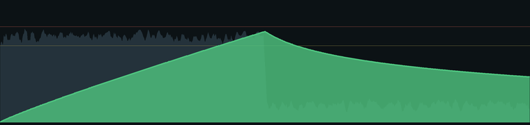

# Hearing Dose Meter

A realtime hearing-safety meter for Windows. It listens to your PC's **actual
audio output** (WASAPI loopback — the same stream OBS records), estimates your
listening level **in dBA**, and tracks a running **daily noise dose**: how much of a
safe day's listening you've spent, with a live graph and a warning when you hit
the limit. Dose accrues while you listen and recovers (front-loaded, log-shaped)
during quiet — and it survives closing the app, crashes, and restarts.



### Reading the graph

There are two filled areas and two dashed lines:

- **Loudness envelope** (muted blue-grey) — your **realtime** listening level (dBA
  Leq), moment to moment, on its own scale. This is the raw "how loud right now".
- **Dose area / curve** (teal fill, coloured line) — your **accumulated** daily
  noise dose. It climbs while you listen and recovers during quiet. The whole
  line is a single colour set by your *current* dose, stepping green → lime →
  amber → orange/red as that dose rises (and back down as it recovers).
- **Two dashed horizontal lines** — the dose thresholds, on the *dose* scale.
  The lower **yellow** line is `prewarn_at` (default **80%**) and the upper
  **red** line is `warn_at` (default **100%** = a full safe daily dose). They're
  reference marks for the climbing dose curve, **not** for the realtime loudness
  — the dose curve reaching them (not the loudness envelope) is what triggers the
  pre-warning and the warning. Both levels are configurable in the `[dose]`
  section of `HearingDose.ini`.

---

## ⚠️ First: calibrate it to *your* gear

The app measures the digital signal and your Windows volume, but it **cannot know
how physically loud your specific headphones + DAC/amp get** — that's the one
thing you tell it, via a single number: **`ceiling_db`**.

> **`ceiling_db`** = the level your gear produces when a maximum (0 dBFS) signal
> plays at **100% Windows volume** — your hardware's loudness ceiling. It's
> expressed as a **free-field-equivalent dB SPL**: the reference the 85 dBA
> safety limits are defined on, *not* eardrum SPL, which runs ~5 dB hotter (see
> below). Everything else — the live volume slider, the actual loudness of
> what's playing — the app measures for you.

Run the app once (see *Install* below) so it creates `HearingDose.ini`; then
right-click the panel → **Edit settings** to change it and **Reload** to apply.

### Calculate it from the spec sheets

```
ceiling_db  ≈  sensitivity (dB SPL per volt)  +  20·log10(amp max output, Vrms)  −  5
```

The **−5 dB** converts reference frames: sensitivity is measured on an
ear-simulator coupler — i.e. **at the eardrum** — but the 85 dBA damage limits
are defined for **sound-field** measurements, and the ear canal's gain adds
roughly 5 dB (A-weighted, on music) between the two. Watch the units: a spec
quoted per milliwatt converts as `dB/V = dB/mW + 10·log10(1000 / impedance)`,
and use the amp's output into *your headphone's impedance*, not its no-load
maximum.

Example: 100 dB/mW at 32 Ω (→ ~115 dB/V) on a dongle doing 1.6 Vrms into 32 Ω →
`115 + 4 − 5 ≈ 114 dB`.

### Verify with a phone SPL meter

1. Install a sound-level-meter app on your phone (**NIOSH SLM** on iOS,
   **Decibel X** on Android) and set its frequency weighting to **A** so it
   reads **dBA**. (Most generic "Sound Meter" apps only show an unlabeled dB
   with no weighting choice — that's usually unweighted SPL, which over-reads
   bass; Decibel X exposes the A-weighting toggle for free.)
2. Find your phone's **actual mic port** (usually a pinhole on the bottom edge,
   next to the USB connector) and make sure the meter app is using it. Centering
   the phone's *body* on the earcup can leave the mic itself outside the cup.
3. Play **pink noise** (any "pink noise" YouTube video or test file) at a
   comfortable-but-clearly-loud level. Any playback volume works — the app
   measures the signal's loudness and the Windows slider live, so your phone
   reading pins down the one remaining unknown — and pink noise holds steady,
   so the two numbers aren't dancing while you compare them. Press the mic port
   against one earcup, centered over the driver, and note the phone's dBA and
   the app's big dBA at the same moment.
4. Apply a one-step correction in the `.ini`, then right-click → **Reload**:

   ```
   new ceiling_db  =  old ceiling_db + (phone dBA − app dBA) + 5
   ```

   The `(phone − app)` difference aligns the app with the phone — don't type the
   phone's reading itself into `ceiling_db`; it isn't that kind of number. The
   **+5** compensates the phone method's typical under-read (uncalibrated phone
   mic, crude coupling), so after reloading the app should sit ~5 dB above the
   phone.

Do **both** if you can — their errors lean opposite ways. The spec method's
assumptions (the amp delivers full rated voltage, the pads couple like the lab
rig) can hardly make it read *low*, while the phone method's weaknesses mostly
push it *low*. If the two land within a few dB, keep the **larger**
`ceiling_db` — over-estimating loudness errs on the side of your ears. A gap
much over 10 dB means something's wrong: a dB/mW spec read as dB/V, a hidden
gain stage Windows can't see, or the phone mic not actually over the driver.

Once set, the app scales correctly across your whole volume range.

> **Safety:** don't calibrate by playing a full-scale tone at 100% volume — that
> is the loudest your rig can physically produce. Calibrate at a normal listening
> level; the model scales up from there.

The default in the `.ini` (`ceiling_db = 114`) is for the author's HEDD D1 + iFi
GO Link 2 (the example above). **It is almost certainly wrong for your gear —
change it first.**

---

## How it works

```
dBA  = ceiling_db + windows_volume_dB + (measured_A_weighted_dBFS + 3.01)
dose += dt / T(dBA)          T(dBA) = 8h / 2**((dBA - 85) / 3)     # NIOSH
```

1. **Capture** the output stream via WASAPI loopback (`pyaudiowpatch`).
2. **A-weight** it with a real IEC-61672 filter → a true dBA.
3. **Add back the volume slider.** Loopback captures the mix *before* Windows
   master volume, so the app reads that slider via `pycaw` and adds it.
4. **Integrate** a NIOSH dose: 100% = 85 dBA for 8 h, 3 dB exchange rate.
5. **Recover** during quiet with a front-loaded, log-shaped curve.

## Install

```
pip install PyAudioWPatch pycaw numpy Pillow
```
(`Pillow` powers the antialiased graph; it falls back to plain Tk if absent.)

```
pythonw HearingDose.pyw            # run it (double-click also works)
python  HearingDose.pyw --selftest # one reading to stdout, then exit
python  tests/test_dose.py         # unit tests
```

Controls: **drag** = move · **right-click** = menu (Reload / Edit .ini / Reset
dose / Quit).

### Run at login (optional)

Create a shortcut in your Startup folder
(`shell:startup`) whose **Target** is your `pythonw.exe` with the script as an
argument (this avoids the flaky `.pyw` file association):

```
Target:  C:\path\to\pythonw.exe  "C:\path\to\HearingDose.pyw"
Start in: C:\path\to\HearingDamage
```

## The model — two confidence levels

**Accrual (spending the budget) — standardised.** NIOSH REL, integrated over the
real signal, so quiet passages cost little and loud drops cost a lot. Trust this.

**Recovery (refunding the budget) — a best estimate, not a standard.** Temporary
threshold shift recovers roughly linearly with the *logarithm* of quiet time:
steep early, long tail. The standards only assume ~16 h of quiet resets a day's
dose; this keeps that window but gives it the empirical log shape. It aims at the
**middle of the plausible range**, not a safe over-estimate — a number you can
trust near the limit. Tune `recovery_hours`, `recovery_t1_min`,
`recovery_ceiling_db` in the `.ini`.

> Full audiometric recovery can still hide synaptic damage ("hidden hearing
> loss"). Treat the budget as guidance, not a guarantee.

## Notes & limitations

- **Calibrate first.** The absolute dBA is only as good as `ceiling_db`; that's
  the dominant uncertainty. The *temporal* accounting (accrual vs recovery over
  time) is the trustworthy part regardless.
- **PC audio only.** Loopback hears what the computer plays, nothing in the room.
- **Short tones integrate correctly.** The meter uses A-weighted energy (Leq),
  and the 3 dB rule is equal-energy, so a 1-second tone contributes its full
  energy regardless of how it lines up with the ~1 s sampling window. For sparse
  or quieter test tones, lower `poll_ms` (e.g. `250`) so each sample aligns more
  tightly with the tone and stays above the accrual threshold.
- **Any gain stage Windows can't read breaks calibration** (e.g. an analog knob
  after the DAC). Keep volume software-controlled.
- **Downtime is assumed quiet:** close and reopen and it recovers the dose for
  the elapsed real time.
- Numbers run lower than a flat SPL meter for bass-heavy music — real A-weighting
  correctly discounts bass.

## Files

- `HearingDose.pyw` — launcher (with single-instance guard)
- `hearingdose/dose.py` — dose engine (NIOSH accrual + log recovery), pure & tested
- `hearingdose/audio.py` — loopback capture, A-weighting, calibration → dBA
- `hearingdose/config.py` — the commented, clamped `.ini`
- `hearingdose/state.py` — dose persistence across restarts
- `hearingdose/app.py` — the tkinter GUI + antialiased graph
- `tests/test_dose.py` — unit tests

## License

MIT — see [LICENSE](LICENSE).
